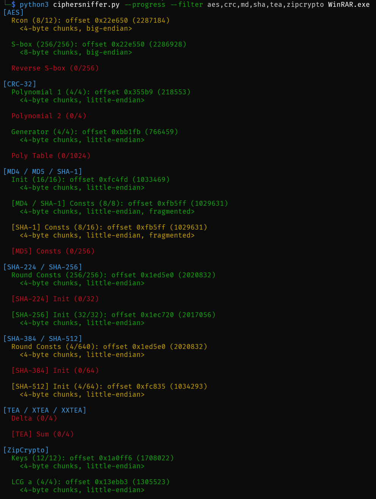

# CipherSniffer

CipherSniffer helps automate the process of identifying cryptographic algorithms in binaries.

It helps detect a number of ciphers, hash algorithms, and encoding schemes by making strategic searches for the cryptographic constants associated with the algorithm.

## Installation

The script can be downloaded and run with Python 3 as is with no external dependencies.

Optionally, `tqdm` can be downloaded for progress bar support, which is helpful for larger binaries:

```bash
python3 -m pip install tqdm
```

## Usage

```
usage: ciphersniffer.py [-h] [-p] [-f FILTER] [-l] [-m MIN_CHUNK_SIZE] [file]

Detect cryptographic algorithms in binary data

positional arguments:
  file                  Binary data file

options:
  -h, --help            show this help message and exit
  -p, --progress        Show progress bars
  -f, --filter FILTER   Algorithm(s) to detect, e.g. 'cha,md,zip'
  -l, --list            List supported algorithms
  -m, --min-chunk-size MIN_CHUNK_SIZE
                        Minimum chunk size to split constants in (default: 4)
```

The script defaults to detecting all supported algorithms (list with `--list`).

To target the search, `--filter` can be used with a comma-separated list of values.
Any algorithm containing the value in its name will be run, so `md` matches both `MD4` and `MD5`.

Search is repated with different splits of the cryptographic constants: 8, 4, 2, 1. Set the minimum chunk size with `--min-chunk-size`.
Defaults to 4 to increase efficiency and decrease false positives - constants are also normally found either as one large block or as 4- or 8-byte chunks as part of instructions.

## Example



## Notes

Detection is based on fixed constants often seen for each algorithm, such as the S-box in AES or round constants for SHA-256.

### Search method

The script searches for cryptographic constants *sequentially* in the data, allowing up to 256 bytes between each chunk. The constants do not need to be *contiguous*.

To maximize coverage, the input is chunked into **1-**, **2-**, **4-**, and **8-byte** values and searched using both **little-endian** and **big-endian** formats. Each sequence is checked in both **forward** and **reverse** order.

When a match is found, the script records the *type*, *length*, *offset*, and the *search parameters* used. If a constant is matched under multiple configurations, the best match is selected - defined as the longest match using the largest chunk size (e.g., 8-byte matches are more reliable than 2-byte ones).

A match is considered **consecutive** if all chunks are found close together. A bit of slack is allowed to account for padding, move instructions, or alignment. If any chunk exceeds the allowed distance from the previous, the match is marked as **fragmented**.

Many algorithms share core constants but also include unique ones. The script groups overlapping matches accordingly. For example:

```
[MD4 / MD5 / SHA-1]
  Init <LE>: 4/4
  [MD4 / SHA-1] Consts: 0/2
  [SHA-1] Consts: 0/4
  [MD5] Consts <LE>: 64/64
```

In this case, the shared initialization values match all three algorithms. However, only the MD5-specific constants were found - making MD5 the likely candidate.

### Match reliability

Match confidence is based on several factors, in order of importance:

- Full matches (all chunks found) > partial matches
- Larger chunk sizes > smaller (false positives are rarer with 8-byte matches than 2-byte)
- Consecutive matches > fragmented

🟢 Green results: Full, consecutive match - high confidence. *Can* be a false positive if chunk size is small.

🟡 Yellow results: Partial match, but either long, consecutive, or found with a large chunk size.

🔴 Red results: Either no match, or a match considered likely to be a false positive.
